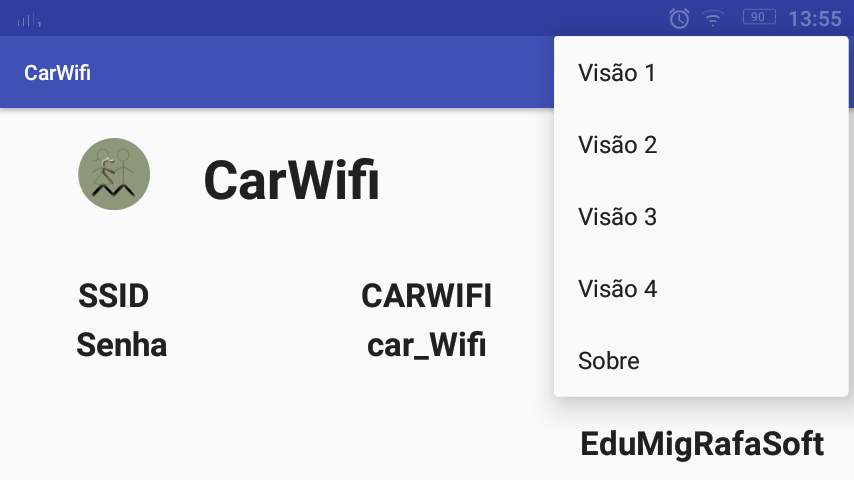
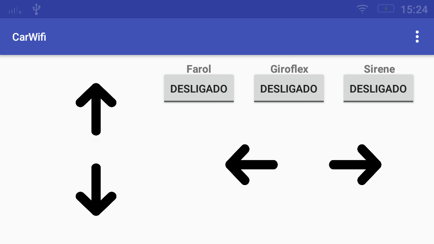
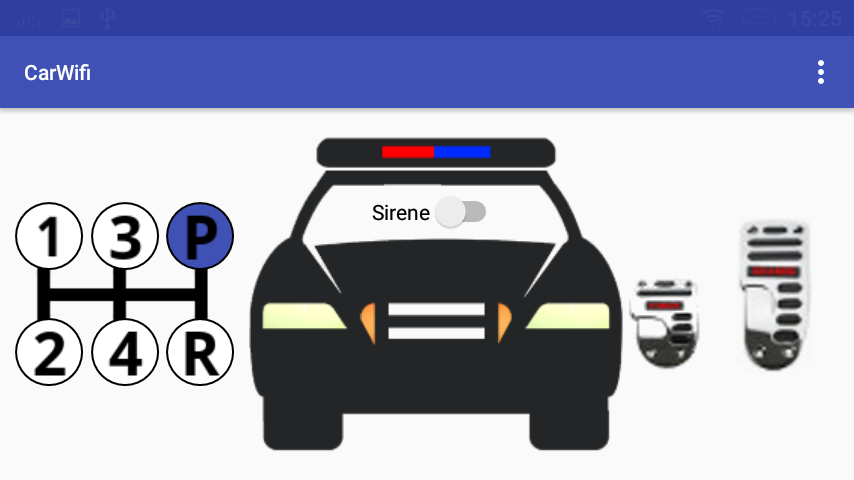
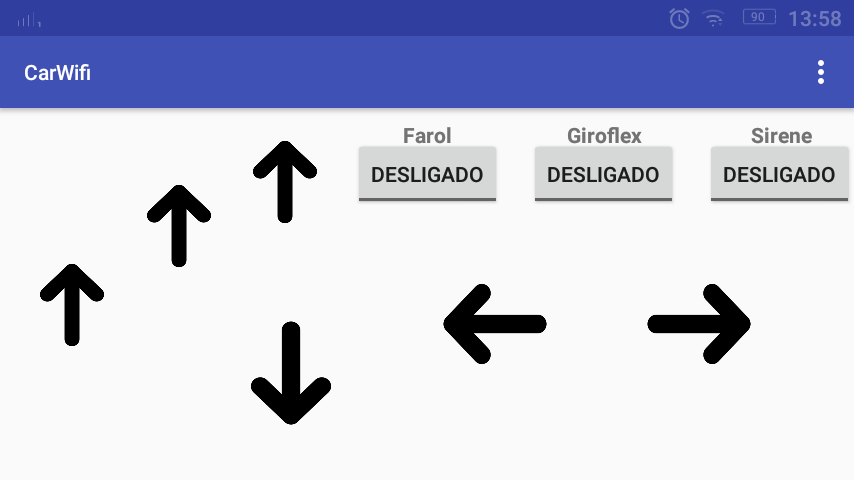
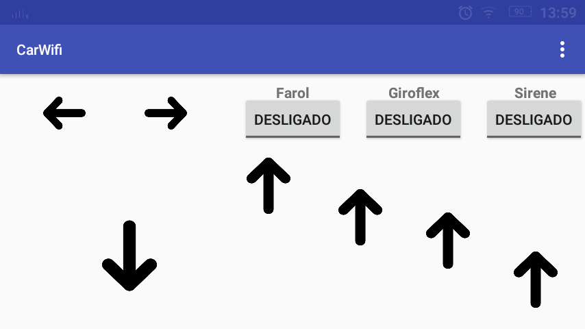

# CarWifi - English

Project RC with ESP8266 and app Android

In the assets folder, is the code for the ESP8266

It was used as an isolator of the ESP8266 for the outputs, the 4n33, but it can be used which suitable optical isolator

To activate the motors, I used the shield with the l298

The smartphone connects directly to the Wifi network, created by ESP8266, and does not require another Wifi network for the connection

# CarWifi - Português

Projeto RC com ESP8266 e aplicativo Android

Na pasta de assets, está o código para o ESP8266

Foi utilizado como isolador do ESP8266 para as saídas, o 4n33, mas pode ser usado qual isolador optico adequado

Para acionar o motores, utilizei o shield com o l298

O smartphone se conecta diretamente a rede Wifi, criado pelo ESP8266, não necessitando de outra rede Wifi para a conecção

# Screenshots

